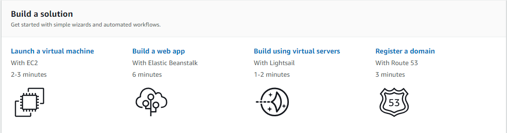
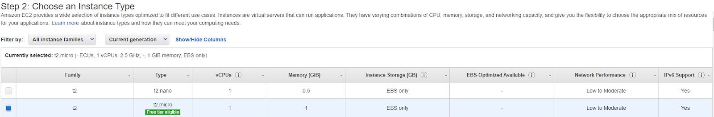
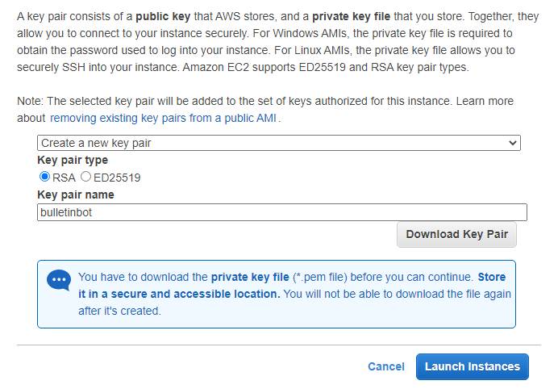
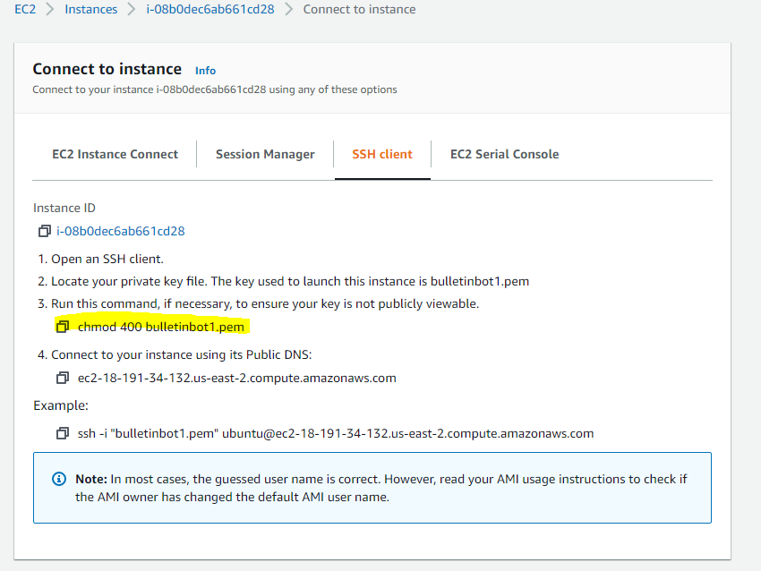
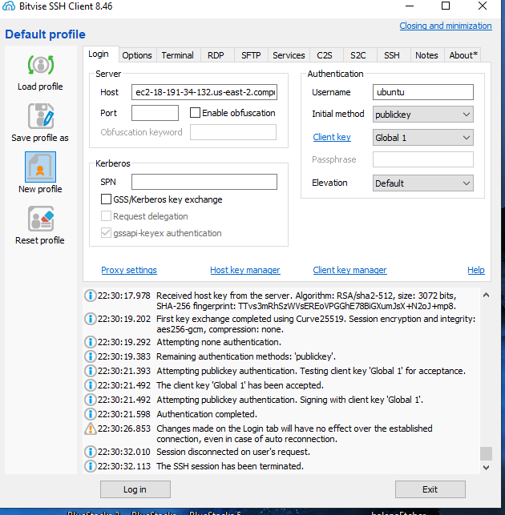
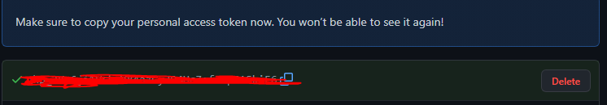

# discordbulletinbot
A bulletin board discord bot that acts as a bulletin board with a persistent database, that allows sharing the same posts across different discord servers. Users can subscribe and unsubscribe to tags, and create posts with tags to send to subscribers.

## Requirements
* AWS account
* Github account
* Optional: Bitvise SSH Client

## After creating AWS account

Navigate to the top right corner to change regions.

## Launch a virtual machine
Click 'Launch a virtual machine'

<kbd></kbd>

## Choose an Instance Type
We are using the free tier VM. Other instances offer more performance. Launch at the bottom.

<kbd></kbd>

Download the key and launch the instance.

<kbd></kbd>

## Connect to Instance
Next connect to the instance.

<kbd></kbd>

Open the Bitvise SSH Client
Use the publickey Initial method.
Use the Client key manager to import the key pair. DO NOT SHARE
Fill out the host and the default user name is ubuntu.
Then Log in.

<kbd></kbd>

## Clone this repository
On Github, click 'Code' on the top right and copy the link provided.
Open a terminal and run the following git command:

```
git clone "url you just copied"
```
Or type out:
```
git clone https://github.com/zkm1/discordbulletinbot.git
```

https://docs.github.com/en/authentication/keeping-your-account-and-data-secure/creating-a-personal-access-token 
Password Auth will be disabled this is how you clone. This token will be repo privileges.

<kbd></kbd>

Use the token as the password and do not share.
```
$cd discordbulletinbot/
```

## Set up Node.js
Follow the instructions in this link [to set up Node.js on an Amazon EC2 instance](https://docs.aws.amazon.com/sdk-for-javascript/v2/developer-guide/setting-up-node-on-ec2-instance.html)

Then, type:
```
$npm install
```


