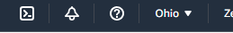
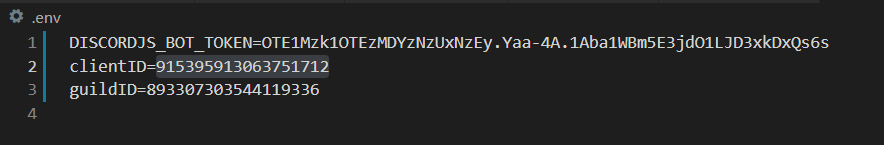

# Discordbulletinbot
A bulletin board discord bot that acts as a bulletin board with a persistent database, that allows sharing the same posts across different discord servers. Users can subscribe and unsubscribe to tags, and create posts with tags to send to subscribers.

## Requirements
* AWS account
* Github account
* Optional: Bitvise SSH Client

## After creating AWS account


**Navigate to the top right corner to change regions.**

## Launch a virtual machine
**Click 'Launch a virtual machine'**

<kbd></kbd>

## Choose an Instance Type
**We are using the free tier VM. Other instances offer more performance. Launch at the bottom.**

<kbd></kbd>

**Download the key and launch the instance.**

<kbd></kbd>

## Connect to Instance
**Next connect to the instance.**

<kbd></kbd>

**Open the Bitvise SSH Client.<br>
Use the publickey Initial method.<br>
Use the Client key manager to import the key pair. DO NOT SHARE<br>
Fill out the host and the default user name is ubuntu.<br>
Then Log in.**

<kbd></kbd>

## Clone this repository
**On Github, click 'Code' on the top right and copy the link provided.
Open a terminal and run the following git command:**

```
git clone "url you just copied"
```
**Or type out:**
```
git clone https://github.com/zkm1/discordbulletinbot.git
```

https://docs.github.com/en/authentication/keeping-your-account-and-data-secure/creating-a-personal-access-token 
**Password Auth will be disabled this is how you clone. This token will be repo privileges.**

<kbd></kbd>

**Use the token as the password and do not share.**
```
$cd discordbulletinbot/
```

## Set up Node.js
Follow the instructions in this link [to set up Node.js on an Amazon EC2 instance.](https://docs.aws.amazon.com/sdk-for-javascript/v2/developer-guide/setting-up-node-on-ec2-instance.html)

Then, type:
```
$npm install
```

## Create a Discord bot application
1. Create your bot application on the [Discord Developer Portal.](https://discord.com/developers/applications) <br>
The application provides keys such as the **CLIENT ID** and the **Bot Token**, whare are necessary for the bot to be registered on a discord server!
> **Note:** You must have a Discord account and to be logged in on the browser version of Discord.

2. Click on the new application button on the top right side of the screen.

<kbd></kbd>

3. You may name the application whatever you want and click **Create**

<kbd></kbd>

4.  You will now see a freshly created application, you can take your time customizing the bot however you wish.

<kbd></kbd>

5. Now navigate to the OAuth2 tab on the left and make note of the CLIENT ID, click copy and paste it into the DiscordBulletinBot’s .env file.

<kbd></kbd>

<kbd></kbd>

6. Now Navigate to the bot tab on the left and click on **Add Bot** and then click **Yes do it!**

<kbd></kbd>

7. Now you will see a newly created bot along with its settings, the only thing we’re interested in is the **BOT TOKEN**, simply click copy under the token header and it will be copied onto your clipboard, copy it straight into the **‘DISCORDJS_BOT_TOKEN=’** field

<kbd></kbd>


<kbd></kbd>

8. Copy your client_id into the link and paste it into your browser, this will add the bot to your server of choice.
```
discord.com/api/oauth2/authorize?client_id=<YOUR CLIENT ID>&scope=bot
```

9. Now your bot is in the discord server of your choosing! Go to the **OAuth section and click on URL Generator Tab**, then choose the settings below and copy the URL to a browser, this will give the bot permissions to do stuff!

<kbd></kbd>

10. The Bot should appear on the right sidebar on the **discord server** where the user lists are available. 

11. Now go to your discord user profile on the browser or, go into the **Advanced Tab** and toggle **Developer Mode**

<kbd></kbd>

12. Now click on **Copy ID** on your server icon, this copies the guild id, which is used to register the slash commands of our bot! Place it in the .env file

<kbd></kbd>

<kbd></kbd>

13. Open up the command prompt, navigate to the discordbulletinbot folder using ‘cd’ and type in npm install to install the dependencies for the bot.

14. Type in npm run dbinit
  - This will create the sqlite database

15. The database will need to have tags for the bot to function

16. Place a .csv file inside the directory of the bot or modify the given .csv file

17. Type in npm run tags <fileName.csv>
  - This will populate the database with tags and allowing the program to function
18. Type in npm run start to run the bot!

**If you want to add the same bot to another server, follow the steps 8-18 again.**
